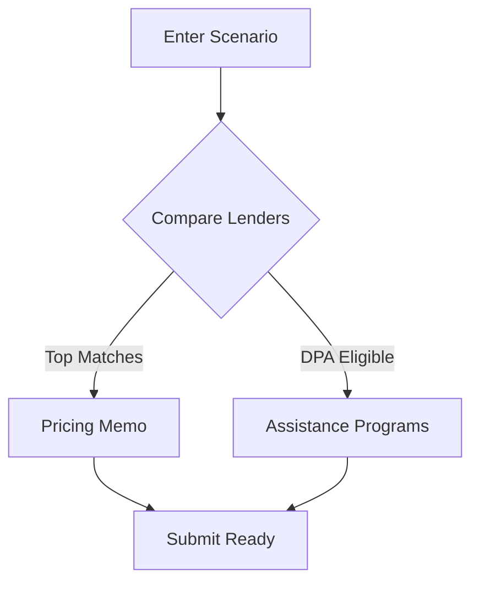

## Overview

LendSquawk provides structured intelligence for lender overlays, empowering loan officers to make informed decisions before loan submission. You can match lenders based on borrower profiles, discover down payment assistance programs, and compare scenarios to optimize eligibility and pricing.

<Columns cols={3}>
  <Card title="Lender Matching" icon="target" href="#lender-matching">
    Score and rank lenders by eligibility fit.
  </Card>
  <Card title="DPA Discovery" icon="gift" href="#dpa-discovery">
    Find relevant down payment assistance programs.
  </Card>
  <Card title="Scenario Comparison" icon="bar-chart-3" href="#scenario-comparison">
    Rescue AUS referrals and compare loan structures.
  </Card>
</Columns>

<Callout kind="tip">
  Start with your borrower profile to unlock personalized recommendations across all features.
</Callout>

## Lender Matching and Eligibility Scoring

Access lender overlays instantly to identify the best fits without manual PDF reviews. Enter borrower details like FICO score, LTV, and DTI, then receive scored matches.

<Tabs>
  <Tab title="Conventional" icon="file-text">
    Compare conventional lenders for 30-year fixed scenarios.
    
    | Lender              | Score | Rate  | Max LTV |
    |---------------------|-------|-------|---------|
    | Pacific Home Loans  | 100   | 6.875%| 85%    |
    | Change Wholesale    | 95    | 7.125%| 80%    |
    | Summit Funding      | 90    | 6.990%| 80%    |
  </Tab>
  <Tab title="FHA" icon="shield">
    FHA-specific overlays with lower FICO thresholds.
    
    View pricing memos and eligibility details side-by-side.
  </Tab>
</Tabs>

<Expandable title="How Scoring Works" default-open="true">
  LendSquawk scores lenders from 0-100 based on overlay alignment. Higher scores indicate better fits for your scenario parameters like `{FICO: 660}`, `{LTV: 75%}`, and `{DTI: 42%}`.
</Expandable>

## Down Payment Assistance Program Discovery

Surface DPA programs tailored to your borrower profile. LendSquawk scans state and national programs to highlight savings opportunities.

<Steps>
  <Step title="Enter Profile" icon="user">
    Input borrower details including location and income.
  </Step>
  <Step title="Review Matches" icon="search">
    See eligible programs like CA HFA MyHome (`$15,000`) or GSFA Platinum (`$22,000`).
  </Step>
  <Step title="Apply Adjustments" icon="edit-3">
    Simulate DTI reductions or reserve additions for eligibility.
  </Step>
</Steps>

<Callout kind="success">
  DPA intelligence can reduce borrower costs by thousands—always check for updates.
</Callout>

## Scenario Comparison and AUS Rescue Workflows

Compare loan scenarios across Conventional, FHA, VA IRRRL, and Non-QM. Rescue AUS referrals by identifying overlays and adjustments.



<Tabs>
  <Tab title="AUS Rescue" icon="zap">
    Common rescues:
    
    - Reduce DTI to `<43%` with co-borrower
    - Add 12-month reserves
    - Switch to FHA for FICO `<660`
  </Tab>
  <Tab title="Non-QM Overlays" icon="layers">
    Guidelines for DSCR and alternative structures.
  </Tab>
</Tabs>

<CodeGroup tabs="API Integration">
  ```javascript
  // Fetch lender matches
  const response = await fetch('https://api.lendsquawk.com/v1/matches', {
    method: 'POST',
    headers: { 'Authorization': 'Bearer YOUR_API_KEY' },
    body: JSON.stringify({
      fico: 660,
      ltv: 75,
      dti: 42
    })
  });
  const matches = await response.json();
  ```
  ```python
  import requests
  
  response = requests.post(
      'https://api.lendsquawk.com/v1/matches',
      headers={'Authorization': 'Bearer YOUR_API_KEY'},
      json={'fico': 660, 'ltv': 75, 'dti': 42}
  )
  matches = response.json()
  ```
</CodeGroup>

<ParamField path="fico" param-type="number" required="true">
  Borrower FICO score (`>620` typical).
</ParamField>

<ParamField path="ltv" param-type="number" required="true">
  Loan-to-value ratio as percentage.
</ParamField>

## Next Steps

Integrate LendSquawk into your LOS workflow for faster closes. Explore [app.lendsquawk.com](https://app.lendsquawk.com) to create your first scenario.

<Columns cols={2}>
  <Card title="Quickstart" icon="rocket" href="/quickstart">
    Set up in minutes.
  </Card>
  <Card title="API Reference" icon="code" href="/authentication">
    Automate with our API.
  </Card>
</Columns>