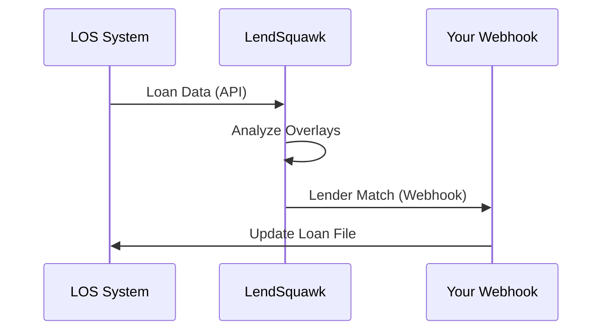

## Overview

LendSquawk connects seamlessly with your loan origination systems (LOS), automated underwriting systems (AUS), pricing engines, and other tools. You gain decision support for lender overlays directly within your workflow without manual data entry. Use native integrations, webhooks, or API connections to pull borrower profiles, scenarios, and eligibility data.

<Callout kind="info">
Review your LOS provider's API documentation before starting. LendSquawk supports major platforms like Encompass, Blend, and ICE Mortgage Technology.
</Callout>

## Popular Integrations

Explore ready-to-use connections for common tools.

<Columns cols={3}>
  <Card title="Encompass LOS" icon="database" href="https://docs.elliemae.com/encompass">
    Sync borrower data and lender match results in real-time.
  </Card>
  <Card title="DU AUS" icon="check-circle" href="https://singlefamily.fanniemae.com/applications-technology/desktop-underwriter">
    Retrieve AUS findings and overlay intelligence automatically.
  </Card>
  <Card title="Pricing Engines" icon="trending-up" href="/configuration">
    Pull rates and eligibility from your pricing tools.
  </Card>
</Columns>

## Connecting to LOS Systems

Set up LOS integrations using OAuth or API keys. Follow these steps for most systems.

<Steps>
  <Step title="Generate API Key" icon="key">
    Log in to your LOS admin panel and navigate to Integrations > API Access. Create a new key for LendSquawk with read/write permissions for borrower data.
  </Step>
  <Step title="Configure in LendSquawk" icon="settings">
    In your LendSquawk dashboard, go to Settings > Integrations. Select your LOS provider and paste the API key.
  </Step>
  <Step title="Test Connection" icon="zap">
    Run a test sync with a sample loan file. Verify borrower FICO, LTV, and DTI pull correctly.
  </Step>
</Steps>

<Tabs>
  <Tab title="Encompass" icon="code">
    Use the Encompass T3 API for webhooks.

````javascript
const axios = require('axios');

async function syncLoan(loanId) {
  const response = await axios.post('https://api.lendsquawk.com/v1/loans/sync', {
    los: 'encompass',
    loanId,
    apiKey: 'YOUR_ENCOMPASS_API_KEY'
  });
  console.log('Sync complete:', response.data);
}
````
  </Tab>
  <Tab title="Blend" icon="code">
    Blend's API endpoints for loan pipelines.

````javascript
const response = await fetch('https://api.lendsquawk.com/v1/integrations/blend', {
  method: 'POST',
  headers: { 'Authorization': 'Bearer YOUR_BLEND_TOKEN' },
  body: JSON.stringify({ pipelineId: 'blend_12345' })
});
````
  </Tab>
</Tabs>

## Setting Up Webhooks

Receive real-time updates on lender matches and AUS rescues via webhooks. Point your endpoint to `https://api.lendsquawk.com/v1/webhooks`.

<CodeGroup tabs="JavaScript,Python">
```javascript
// Listen for lender match events
app.post('/webhook/lendsquawk', (req, res) => {
  const { event, data } = req.body;
  if (event === 'lender_match') {
    console.log('Best lender:', data.topMatch);
  }
  res.status(200).send('OK');
});
```

```python
from flask import Flask, request

app = Flask(__name__)

@app.route('/webhook/lendsquawk', methods=['POST'])
def webhook():
    data = request.json
    if data['event'] == 'lender_match':
        print(f"Best lender: {data['data']['topMatch']}")
    return 'OK', 200
```
</CodeGroup>

<ParamField header="LendSquawk-Signature" param-type="string" required="true">
  HMAC SHA256 signature for webhook verification using your secret.
</ParamField>

<ParamField body="event" param-type="string" required="true">
  Event type: `lender_match`, `aus_rescue`, `dpa_update`.
</ParamField>

## Managing Third-Party APIs and Document Libraries

Connect custom document libraries or pricing APIs via LendSquawk's universal adapter.

<Expandable title="Advanced Configuration" default-open="false">
  Edit `integrations.json` in your config:

````json
{
  "customApis": [
    {
      "name": "Custom Pricing",
      "endpoint": "https://your-pricing.com/api/rates",
      "auth": "YOUR_API_KEY"
    }
  ]
}
````

  Restart your LendSquawk agent to apply changes.
</Expandable>



## Next Steps

Test your first integration with a sample scenario. Monitor sync logs in the LendSquawk dashboard for any issues.

<Callout kind="tip">
  Need help? Check the [troubleshooting guide](/configuration#troubleshooting) or contact support.
</Callout>